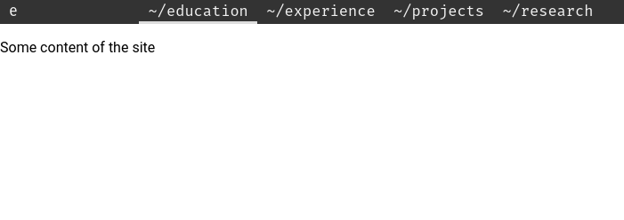

# dmenu-react

> Made with create-react-library

[](https://www.npmjs.com/package/dmenu-react) [](https://standardjs.com)

A [dmenu](https://tools.suckless.org/dmenu/) like navbar component written in React.



## Install

```bash
npm install --save dmenu-react
```

## Usage

```tsx
import React, { Component } from 'react'

import DMenu from 'dmenu-react'
import 'dmenu-react/dist/index.css'

const menuElement = [{
    name: "home",
    url: "/"
},
{
    name: "blog",
    url: "/blog"
}]
class Example extends Component {
    render() {
        return <DMenu menu={menuElement} active={0} />
    }
}
```

## License

MIT © [lucarin91](https://github.com/lucarin91)
